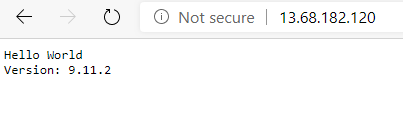
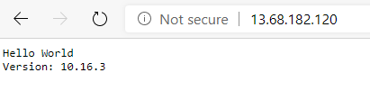

# Run Containers in Azure Kubernetes Service

## Objectives

In this lab, we will take the containers we created earlier and deploy them to Kubernetes running in Azure Kubernetes Service (AKS).

In this module, you will:

- Create an Azure Kubernetes Service cluster
- Create a service manifest that describes the application we will deploy

## Prerequisites

This lab has some additional requirements from the prior labs because AKS needs to be able to provision Azure resources
on its own.

### Azure AD Service Principal

In Azure, services and applications can be permitted to run provisioning and management operations through Azure AD
[Service Principal Names (SPNs)](https://docs.microsoft.com/en-us/azure/active-directory/develop/howto-create-service-principal-portal). SPNs are basically user accounts for applications. The application authenticates
to the Azure Resource Manager using this SPN Azure AD account, then uses permissions assigned to that account to perform
actions in Azure.

During its deployment, AKS can create a SPN that is then assigned to the service and granted the appropriate permissions.
If your Azure account is connected with an Azure AD instance managed by your organization, you may not have the permissions
to create SPNs in the organization Azure AD. A SPN can be created in advance by an authorized Azure AD administrator then
used for the AKS deployment. The steps for deploying this way are slightly different, but once deployed, the AKS cluster will
run the same way.

## Concepts

### Kubernetes

Kubernetes is an open-source container orchestrator, automating the processes required to keep complicated container-based
healthy, up-to-date, and running at scale.

_Do I need a container orchestrator?_ This is a good question to ask before embarking on the journey to learn and implement Kubernetes. As with any other technology, there is effort required to successfully use a complicated technology like Kubernetes
so it may not be necessary for every project. If you are running individual containers and simply need monitoring, scale-out and deployment automation, Azure App Service is a great choice and with less to learn and deploy.

### Azure Kubernetes Service (AKS)

Azure Kubernetes Service (AKS) is a managed deployment of Kuberentes, based on upstream open-source Kubernetes. AKS itself
is open-source under the [AKS-Engine](https://github.com/Azure/aks-engine) project.

While it is possibly (and not entirely uncommon) to run a Kubernetes cluster on Azure IaaS, AKS provides managed services
for the Kubernetes master nodes and customers are only charged for the worker nodes that run the container workloads. There
is no charge for AKS beyond the compute and other infrastructure resources the services use.

## Exercise 1 - Create an AKS Cluster

### 1. Create a Resource Group for AKS

First, we'll create a new Resource Group where we will deploy AKS. Using the Cloud Shell as in prior steps, create a
Resource Group.

```console
$ az group create --name learn-aks-rg --location <choose-a-location>
```

### 2. Create the AKS Cluster

The `az aks create` command has many optional parameters that are useful for creating production clusters. For this
lab we will keep it simple and use defaults and automatic settings for most. (This operation will take about 5 minutes.)

```console
$ az aks create --resource-group learn-aks-rg --name myAKSCluster --node-count 1 --enable-addons monitoring --generate-ssh-keys
```

When this operation completes, the result is some cluster information including a cluster FQDN, the Kubernetes version deployed
and the status of the cluster:

```json
{
 ...
  "agentPoolProfiles": [
    {
      "availabilityZones": null,
      "count": 1,
      "enableAutoScaling": null,
      "enableNodePublicIp": null,
      "maxCount": null,
      "maxPods": 110,
      "minCount": null,
      "name": "nodepool1",
      "nodeTaints": null,
      "orchestratorVersion": "1.13.10",
      "osDiskSizeGb": 100,
      "osType": "Linux",
      "provisioningState": "Succeeded",
      "scaleSetEvictionPolicy": null,
      "scaleSetPriority": null,
      "type": "AvailabilitySet",
      "vmSize": "Standard_DS2_v2",
      "vnetSubnetId": null
    }
  ],
  "apiServerAccessProfile": null,
  "dnsPrefix": "<your-cluster>-<your-rg>-<random>",
  "enablePodSecurityPolicy": null,
  "enableRbac": true,
  "fqdn": "<your-cluster-name>.hcp.eastus.azmk8s.io",
  "id": "...",
  "identity": null,
  "kubernetesVersion": "1.13.10",
  "location": "eastus",
  "maxAgentPools": 1,
  "name": "<your-cluster-name",
  "networkProfile": {
    "dnsServiceIp": "10.0.0.10",
    "dockerBridgeCidr": "172.17.0.1/16",
    "loadBalancerProfile": null,
    "loadBalancerSku": "Basic",
    "networkPlugin": "kubenet",
    "networkPolicy": null,
    "podCidr": "10.244.0.0/16",
    "serviceCidr": "10.0.0.0/16"
  },
  "nodeResourceGroup": "MC_<your-resource-group>_myAKSCluster_eastus",
  "provisioningState": "Succeeded",
  "resourceGroup": "learn-aks-rg",
  ...
}
```

If you go back to your subscription, you'll notice another new Resource Group starting with 'MC\_' followed by your AKS resource group name then the region name. This is the Resource Group that AKS will manage and use to deploy VMs, networking and other
IaaS resource for your cluster. Take a look in that Resource Group and explore what it created.

We have one step that we'll need to deploy the container image we created earlier in Azure Container Registry -- we need to link the ACR instance with
this AKS cluster:

```console
$ az aks update -n <your-cluster-name> -g learn-aks-rg --attach-acr $ACR_NAME
AAD role propagation done[############################################]  100.0000%
```

### 3. Set up the Kubernetes CLI and connect to your cluster

Our Kubernetes cluster is now running but we don't have a way to communicate with it yet. The Kubernetes CLI (called `kubectl`) is already installed in Cloud Shell. If you need to install it in case you're running locally or on a VM, the following command
will install it:

```console
# not needed if using Azure Cloud Shell (kubectl is pre-installed there)
$ az aks install-cli
```

Now that we have kubectl, we can get our cluster credentials using the cluster name used when creating the cluster:

```console
$ az aks get-credentials --resource-group learn-aks-rg --name <your-cluster-name>
Merged "myAKSCluster" as current context in /home/andrej/.kube/config
```

Next we can use kubectl to see ur worker nodes:

```console
$ kubectl get nodes
NAME                       STATUS   ROLES   AGE   VERSION
aks-nodepool1-26513128-0   Ready    agent   14m   v1.13.10
```

We have one node that's ready to go. Let's get some code deployed!

## Exercise 3 - Create a manifests and deploy the application to AKS

Kubernetes uses a series of declarative configuration files called manifests to define and change how different cluster resources should be run. These
are usually written in the YAML markup format. For this application our manifest will contain sections:

- Deployment: A set of pods specifying the container registry image to deploy and the compute, memory and networking resources required
- Service: An inbound connection to a Deployment

```YAML
# Deployment for the Hello Service
apiVersion: apps/v1
kind: Deployment
metadata:
  name: hello-1-0
spec:
  replicas: 3
  selector:
    matchLabels:
      app: hello
      version: "1.0"
  template:
    metadata:
      labels:
        app: hello
        version: "1.0"
    spec:
      containers:
        - name: hello
          image: <YOUR_ACR_URL>/<YOUR_IMAGE_NAME>:<YOUR_IMAGE_TAG>
          imagePullPolicy: Always
          ports:
            - containerPort: 80
              name: http
---
# Service definition for the Hello API
apiVersion: v1
kind: Service
metadata:
  name: hello
  labels:
    app: hello
spec:
  ports:
    - port: 80
      name: http
  selector:
    app: hello
  type: LoadBalancer
```

You can download a copy of this file [here](assets/hello-app.yaml)

A manifest can contain multiple sections separated by a line of dashes. The Service is connected to the Deployment by label matching. In this case, the `selector` attribute matches the app name label defined in the Deployment section. This [label/selector mechanism](https://kubernetes.io/docs/concepts/overview/working-with-objects/labels/) is powerful and allows for advanced deployment scenarios.

Here we will use the `kubectl` command to deploy this manifest. The `apply` command applies a manifest and the `-f` parameter gets the manifest
from a file (instead an interactive editor).

If you need to quickly look up common `kubectl` commands, check out the [kubectl cheat sheet](https://kubernetes.io/docs/reference/kubectl/cheatsheet/).

```console
$ kubectl apply -f hello-app.yaml
deployment.apps/hello-app created
service/hello-app created
```

How let's watch the service get deployed and see the endpoint. The `--watch` option will keep refreshing the output as it changes. We are watching the service because that's the network path from outside the cluster to the running containers in the cluster. We'll explore how this was actually done for us later.

```console
kubectl get service hello-app --watch
```

(press Control-C to stop the `watch`)

Eventually, the output should look something like this:

```console
NAME        TYPE           CLUSTER-IP    EXTERNAL-IP     PORT(S)        AGE
hello-app   LoadBalancer   10.0.124.30   13.68.182.120   80:31005/TCP   104s
```

The application should be responding on the EXTERNAL-IP address listed from the `get service` command. Now open a web browser and test the app. You should see a hello world message with the 9x Node.js runtime version:


## Exercise 4 - Examine cluster resources

Now that we have a container running, let's look behind the scenes and see what's really happening here from a network perspective. Kubernetes and AKS are
orchestrating resources on our behalf. Remember that extra Resource Group that AKS created after we created our cluster? Let's list out the resources there and see what actually got deployed. (You can find the name of the AKS cluster Resource Group by looking for one that starts with 'MC\_'.) We'll use `--output table` for a more concise list.

```console
$ az resource list --resource-group MC_learn-aks_myAKSCluster_eastus --output table
Name                                                                ResourceGroup                     Location    Type                                          Status
------------------------------------------------------------------  --------------------------------  ----------  --------------------------------------------  --------
nodepool1-availabilitySet-26513128                                  MC_learn-aks_myAKSCluster_eastus  eastus      Microsoft.Compute/availabilitySets
aks-nodepool1-26513128-0_OsDisk_1_d9f4b367767a4c02923116dc43b1b3c4  MC_LEARN-AKS_MYAKSCLUSTER_EASTUS  eastus      Microsoft.Compute/disks
aks-nodepool1-26513128-0                                            MC_learn-aks_myAKSCluster_eastus  eastus      Microsoft.Compute/virtualMachines
aks-nodepool1-26513128-0/computeAksLinuxBilling                     MC_learn-aks_myAKSCluster_eastus  eastus      Microsoft.Compute/virtualMachines/extensions
aks-nodepool1-26513128-0/cse-agent-0                                MC_learn-aks_myAKSCluster_eastus  eastus      Microsoft.Compute/virtualMachines/extensions
kubernetes                                                          MC_learn-aks_myAKSCluster_eastus  eastus      Microsoft.Network/loadBalancers
aks-nodepool1-26513128-nic-0                                        MC_learn-aks_myAKSCluster_eastus  eastus      Microsoft.Network/networkInterfaces
aks-agentpool-26513128-nsg                                          MC_learn-aks_myAKSCluster_eastus  eastus      Microsoft.Network/networkSecurityGroups
kubernetes-ae9751803eedb11e9937ed25d60b233e                         MC_learn-aks_myAKSCluster_eastus  eastus      Microsoft.Network/publicIPAddresses
aks-agentpool-26513128-routetable                                   MC_learn-aks_myAKSCluster_eastus  eastus      Microsoft.Network/routeTables
aks-vnet-26513128                                                   MC_learn-aks_myAKSCluster_eastus  eastus      Microsoft.Network/virtualNetworks
```

We can see the usual resources associated with a VM, in this case, the one worker node in our cluster, along with a virtual network used for intra-cluster
communication. We can also see a Public IP Address and Load Balancer. These are the Azure resources created by the Service section of our deployment manifest.

## Exercise 4 - Scale the application

Now our application has become popular and we need to add capacity. Kubernetes' powerful declarative configuration model makes it easy. First, let's look at our cluster
size and deployment scale:

```console
$ kubectl get deployments
NAME        READY   UP-TO-DATE   AVAILABLE   AGE
hello-app   1/1     1            1           22m
```

We can see that we have the one instance we requested. Let's edit one line our hello-app.yaml file and request more replicas (instances) of our pod:

```yaml
replicas: 4
```

Now we apply the same manifest back to our cluster. Kubernetes will match this to the running deployment and only apply the difference:

```console
$ kubectl apply -f hello-app.yaml
deployment.apps/hello-app configured
service/hello-app unchanged
```

Kubernetes warned us that there was no change to the service (that's correct -- we didn't change any network settings) but that we updated the Deployment. Now if we
list out the deployment, we can see our instances spinning up:

```console
$ kubectl get deployments --watch
NAME        READY   UP-TO-DATE   AVAILABLE   AGE
hello-app   4/4     4            4           27m
```

(press Control-C to stop the `watch`)

If you run this command soon after the `apply` command, you'll see the ready count increase until it meets the four replicas we requested.

## Exercise 5 - Deploy a rolling update

We're ready to update our application to the next version! This this update, we are simply updating the version of Node.js our app uses.

In the Azure Cloud Shell:

```console
code Dockerfile
```

Our Dockerfile should be updated as follows (note the node version change on the first line):

```dockerfile
FROM    node:10-alpine
ADD     https://raw.githubusercontent.com/Azure-Samples/acr-build-helloworld-node/master/package.json /
ADD     https://raw.githubusercontent.com/Azure-Samples/acr-build-helloworld-node/master/server.js /
RUN     npm install
EXPOSE  80
CMD     ["node", "server.js"]
```

Save and close the changes. Build a new container image using a v2 version tag (don't forget the . at the end!)

```console
az acr build --registry $ACR_NAME --image helloacrtasks:v2 .
```

We now have the v2 version of our application in our ACR. Now to deploy that update to our Kubernetes cluster. Edit the `hello-app.yaml'
manifest, updating the image name to v2 (do not change the manifest apiVersion elsewhere in the document -- that should remain v1)

```yaml
image: akacr2.azurecr.io/helloacrtasks:v1
```

Now apply the new manifest:

```console
$ kubectl apply -f hello-app.yaml
deployment.apps/hello-app configured
service/hello-app unchanged
```

If we check the running pods, we can see that all of them have been replaced with new ones running the new version of our app:

```console
$ kubectl get pods
NAME                       READY   STATUS    RESTARTS   AGE
hello-app-5c6cfbf9-4nx9c   1/1     Running   0          54s
hello-app-5c6cfbf9-5h9z4   1/1     Running   0          47s
hello-app-5c6cfbf9-dpmgw   1/1     Running   0          47s
hello-app-5c6cfbf9-k26f4   1/1     Running   0          54s
```

You can check the version of the running code in the browser and see the new version of the app is indeed running, sporting the 10.x Node.js runtime:


